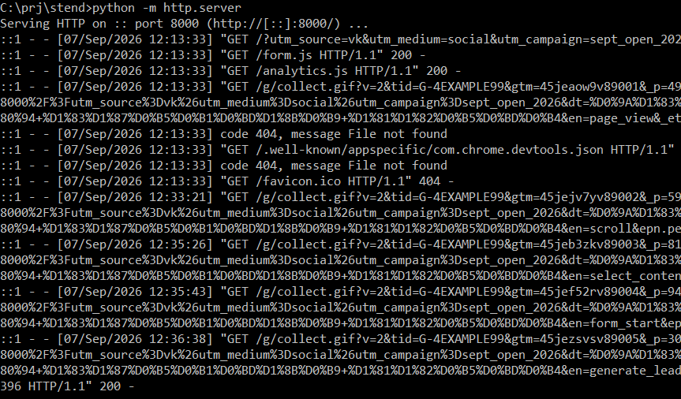
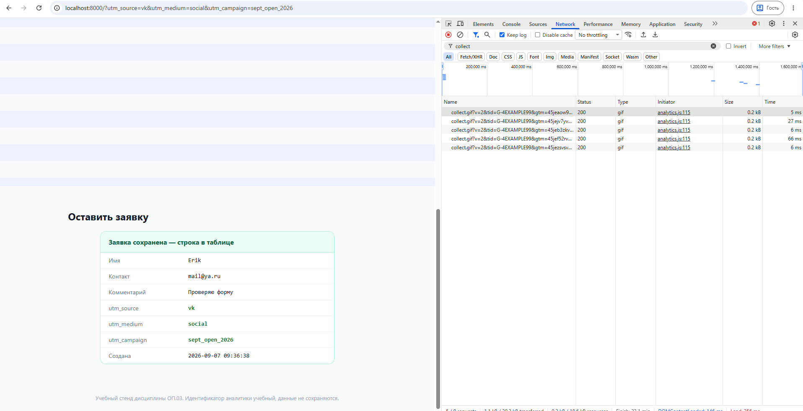

# Домашнее задание 1

## Начало работы

* Запустил локальный веб сервер при помощи python

* Открыл браузер в гостевом профиле (чтобы не мешали расширения)

* Запустил devtools и открыл ссылку `http://localhost:8000/?utm_source=vk&utm_medium=social&utm_campaign=sept_open_2026`

* Сделал все события: прокрутка, переход к форме по кнопке, заполнение формы.

 

### Разбор событий аналитики

* В логе у меня получилось 5 событий:
    * page_view (когда открыл ссылку)

        | tag | val |
        | -- | -- |
        | v | 2 |
        | tid | G-4EXAMPLE99 |
        | gtm | 45jeaow9v89001 |
        | _p | 493271245 |
        | cid | 1788772413.156467608 |
        | ul | ru-ru |
        | sr | 1920x1080 |
        | _s | 1 |
        | sid | 1788772413 |
        | sct | 1 |
        | seg | 1 |
        | dl | http://localhost:8000/?utm_source=vk&utm_medium=social&utm_campaign=sept_open_2026 |
        | dt | Курс «Аналитика с нуля» — учебный стенд |
        | en | page_view |
        | _et | 1 |

    * scroll (прокрутка вниз)
        | tag | val |
        | -- | -- |
        | v | 2 |
        | tid | G-4EXAMPLE99 |
        | gtm | 45jejv7yv89002 |
        | _p | 592542244 |
        | cid | 1788772413.156467608 |
        | ul | ru-ru |
        | sr | 1920x1080 |
        | _s | 2 |
        | sid | 1788772413 |
        | sct | 1 |
        | seg | 1 |
        | dl | http://localhost:8000/?utm_source=vk&utm_medium=social&utm_campaign=sept_open_2026 |
        | dt | Курс «Аналитика с нуля» — учебный стенд |
        | en | scroll |
        | epn.percent_scrolled | 90 |
        | _et | 1187369 |

    * select_content (нажал кноку оставить заявку)
        | tag | val |
        | -- | -- |
        | v | 2 |
        | tid | G-4EXAMPLE99 |
        | gtm | 45jeb3zkv89003 |
        | _p | 810075832 |
        | cid | 1788772413.156467608 |
        | ul | ru-ru |
        | sr | 1920x1080 |
        | _s | 3 |
        | sid | 1788772413 |
        | sct | 1 |
        | seg | 1 |
        | dl | http://localhost:8000/?utm_source=vk&utm_medium=social&utm_campaign=sept_open_2026 |
        | dt | Курс «Аналитика с нуля» — учебный стенд |
        | en | select_content |
        | ep.content_type | cta |
        | ep.item_id | lead_button |
        | _et | 1312580 |

    * form_start (кликнул на форме чтобы начать ее заполнять)
        | tag | val |
        | -- | -- |
        | v | 2 |
        | tid | G-4EXAMPLE99 |
        | gtm | 45jef52rv89004 |
        | _p | 946963341 |
        | cid | 1788772413.156467608 |
        | ul | ru-ru |
        | sr | 1920x1080 |
        | _s | 4 |
        | sid | 1788772413 |
        | sct | 1 |
        | seg | 1 |
        | dl | http://localhost:8000/?utm_source=vk&utm_medium=social&utm_campaign=sept_open_2026 |
        | dt | Курс «Аналитика с нуля» — учебный стенд |
        | en | form_start |
        | ep.form_id | lead_main |
        | _et | 1329875 |

    * generate_lead (отправил заполненную форму)
        | tag | val |
        | -- | -- |
        | v | 2 |
        | tid | G-4EXAMPLE99 |
        | gtm | 45jezsvsv89005 |
        | _p | 308480308 |
        | cid | 1788772413.156467608 |
        | ul | ru-ru |
        | sr | 1920x1080 |
        | _s | 5 |
        | sid | 1788772413 |
        | sct | 1 |
        | seg | 1 |
        | dl | http://localhost:8000/?utm_source=vk&utm_medium=social&utm_campaign=sept_open_2026 |
        | dt | Курс «Аналитика с нуля» — учебный стенд |
        | en | generate_lead |
        | ep.form_id | lead_main |
        | ep.source | vk |
        | ep.medium | social |
        | ep.campaign | sept_open_2026 |
        | epn.value | 0 |
        | ep.currency | RUB |
        | _et | 1384396 |

## Анализ
### 1. Где источник определён, а где `(not set)`?

Источник определён явно из **UTM-меток** в URL: `utm_source=vk`, `utm_medium=social`, `utm_campaign=sept_open_2026`. Поэтому для события `generate_lead` в параметрах передались значения `source = vk`, `medium = social` и `campaign = sept_open_2026`. Для остальных событий эти UTM-параметры также присутствуют в URL, поэтому Google Analytics может связать действия пользователя с этим источником. Значение **`(not set)`** появляется, когда Google Analytics не получил необходимое значение параметра или не смог определить его для конкретного отчёта/измерения.

### 2. Точка разрыва цифровой воронки

Мне кажется самая вероятная точка разрыв будет **между `form_start` и `generate_lead`**. Т.е. пользователь начал заполнять форму, но не завершает её отправкой. Чтобы проверить эту точку, в GA4 можно построить **исследование «Воронка»** с двумя шагами: `form_start` → `generate_lead`. Затем нужно посмотреть количество пользователей на каждом этапе и процент перехода между ними. Если пользователей с `form_start` значительно больше, чем `generate_lead`, значит, часть пользователей покидает форму до отправки.
