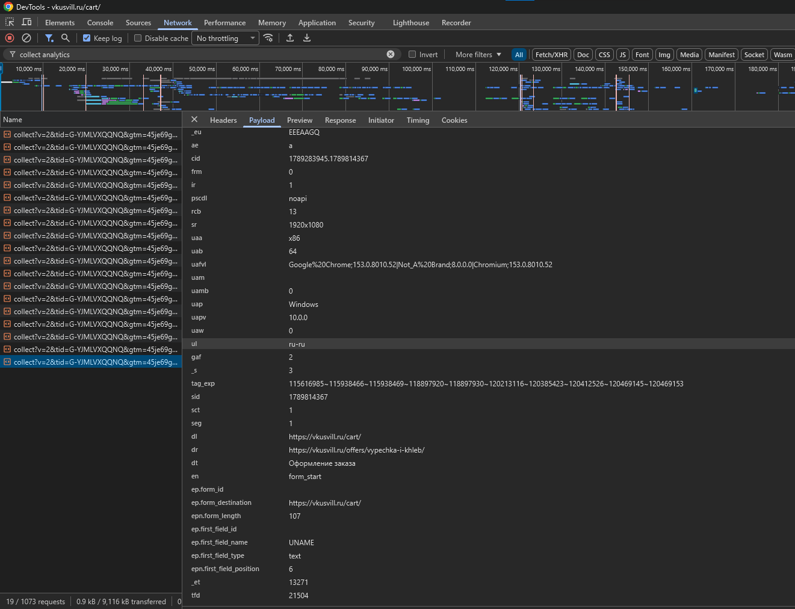
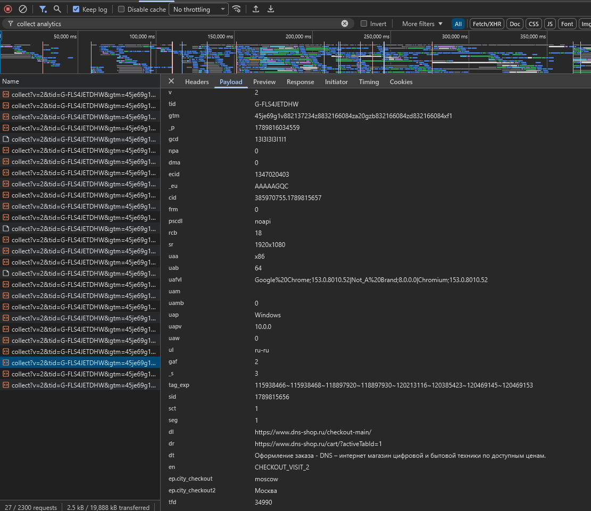

# Задание 2 · Где бизнес теряет клиентов: анализ воронки цифрового продукта

Цель работы — провести самостоятельное исследование пользовательской
и маркетинговой воронки, найти подтверждения в реальных источниках и кейсах
российского рынка, сформулировать собственные выводы, а также создать
структуру Google Analytics 4 по материалам презентации.

## Часть 1. Исследование воронки

Выберите российский цифровой продукт, интернет-магазин, сервис, приложение,
маркетплейс, онлайн-сервис или другую сферу, где можно проследить путь
пользователя от первого контакта до целевого действия.

Я довольно долго искал крупные российские компании, которые используют google analytics в настоящий момент. Как основной обьект исследования я выбрал ВкусВилл. Для второго кейса я выбрал DNS

Для доказательства того, что ВкусВилл использует google analytics, я приложил скриншот из chrome devtools

Отображенное событие на нем - начало заполнение формы в корзине.

Для доказательства того, что DNS использует google analytics, я приложил скриншот из chrome devtools

Отображенное событие на нем - посещение корзины, DNS использует кастомные события (на скриншоте видно, что en = CHECKOUT_VISIT_2).

Отчёт  [homework_02.md](homework_02.md)

## Часть 2. Google Analytics 4

Отчёт  [homework_02.md#часть-2-google-analytics-4](homework_02.md#часть-2-google-analytics-4)
