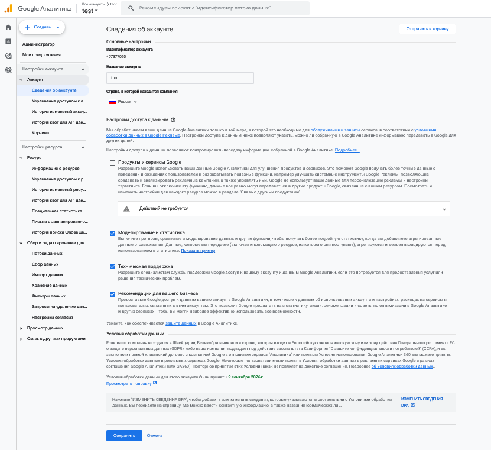
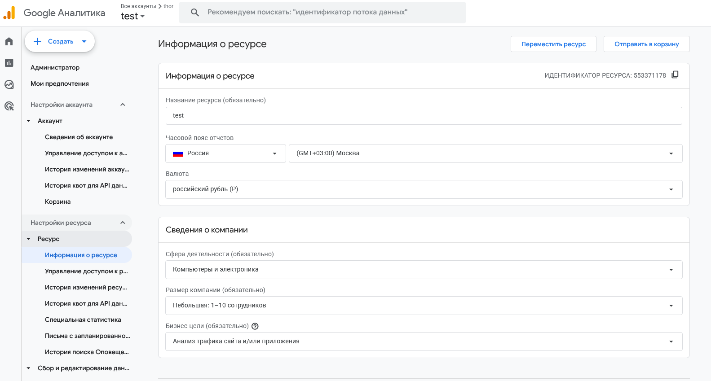
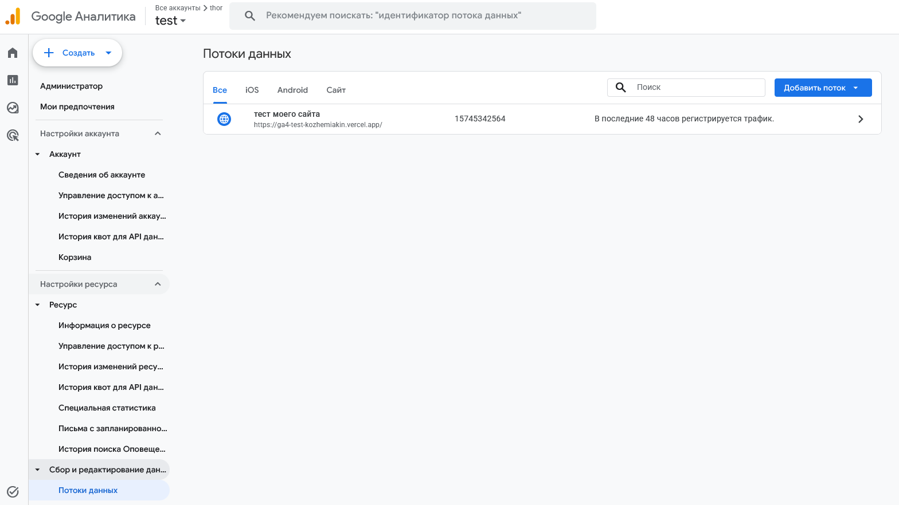
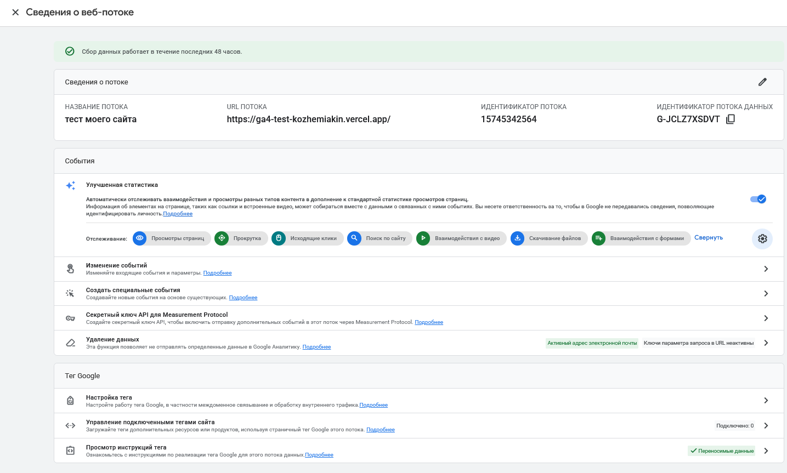

# Домашняя работа № 2 · Где бизнес теряет клиентов

**Дисциплина:** ОП.03 «Информационные технологии»

| Поле | Значение |
|---|---|
| Фамилия, имя, отчество | Кожемякин Эрик Романович |
| Группа | 9/2-РПО-25/1 |
| Номер работы | 2 |
| Тема работы | Анализ воронки цифрового продукта и структура Google Analytics 4 |
| Дата сдачи | 19.09.2026 |
| Ветка | `hw-02` |

---

# Часть 1. Исследование воронки

## 1.1. Объект исследования

| Поле | Значение |
|---|---|
| Компания, сервис или отрасль | «ВкусВилл» — российская розничная сеть и собственная торговая марка продуктов для здорового питания; онлайн-доставка через мобильное приложение и сайт |
| Адрес сайта или приложения | https://vkusvill.ru/ (сайт), приложение «ВкусВилл: доставка продуктов» — App Store, Google Play, RuStore |
| Целевое действие | Оформление и оплата заказа (доставка или самовывоз) |
| Почему выбран этот объект | В 2025 году онлайн-доставка обеспечила 53% выручки всей сети «ВкусВилл», за год было доставлено 147,5 млн заказов, а в рекордный день (30 декабря) — более 600 000 заказов. Это значит, что цифровая воронка — не второстепенный, а основной канал бизнеса, и любые потери в ней напрямую влияют на выручку. Дополнительно у «ВкусВилла» есть открытые кейсы UX-исследований и продвижения приложения, на которые можно опереться |

## 1.2. Воронка

| № | Этап | Что считается переходом дальше | Метрика этапа |
|---|---|---|---|
| 1 | Реклама / карточка в сторе | Клик по рекламе (в т. ч. контекст, Smart TV) или переход к карточке приложения в App Store / Google Play / RuStore | CTR рекламы; конверсия «показ карточки → установка» |
| 2 | Установка приложения / визит на сайт | Первый запуск приложения (first_open) или визит на сайт | Число установок / визитов; доля установок от показов карточки |
| 3 | Регистрация и карта лояльности | Ввод номера телефона, автоматическое оформление виртуальной карты лояльности | Доля новых пользователей, оформивших карту (sign_up rate) |
| 4 | Просмотр каталога / карточки товара | Просмотр карточки товара, использование «Избранного» и «Списков» | Доля сессий с ≥1 просмотром товара; доля сессий с использованием «Избранного»/«Списков» |
| 5 | Добавление в корзину и оформление заказа | Событие add_to_cart → выбор способа получения (доставка/самовывоз) → подтверждение города и адреса | Конверсия «просмотр → корзина»; конверсия «корзина → оформление» (в т. ч. по городам и устройствам) |
| 6 | Оплата и повторный заказ | Событие purchase; повторная покупка в течение 30 дней | Конверсия «оформление → покупка»; доля повторных заказов (repeat purchase rate) |

## 1.3. Источники

### Источник 1

| Поле | Значение |
|---|---|
| Название материала | «В 2025 году выручка сети «ВкусВилл» выросла на 9,7%» |
| Автор или организация | Retail.ru (публикация со ссылкой на данные компании «ВкусВилл») |
| Дата публикации | 12 февраля 2026 |
| Прямая ссылка | https://www.retail.ru/news/v-2025-godu-vyruchka-seti-vkusvill-vyrosla-na-9-73-12-fevralya-2026-274420/ |

**Выписка из материала** (ключевая мысль, цифра, наблюдение, результат):

> За 2025 год онлайн-доставка обеспечила 53% выручки сети «ВкусВилл»; всего доставлено 147,5 млн заказов, а в рекордный день (30 декабря) оформлено более 600 000 заказов за сутки. Число покупателей с картами сети выросло на 5,4% и составило 9,3 млн человек.

**Что подтверждает и как связано с моей воронкой** (своими словами):

> Показывает, что доставка — не дополнительный, а основной канал выручки «ВкусВилла». Это подтверждает, что любая потеря на этапах воронки (регистрация, корзина, оформление) напрямую и в больших масштабах влияет на бизнес-результат компании.

**Цифры из источника и этап воронки, к которому относятся:**

> 53% выручки — этап 6 (оплата); 147,5 млн заказов и 600 000 заказов за сутки — этап 6; 9,3 млн держателей карт — этап 3 (регистрация/карта лояльности).

### Источник 2

| Поле | Значение |
|---|---|
| Название материала | Кейс продвижения приложения «ВкусВилл» в RuStore (ASO) |
| Автор или организация | Агентство IT-Agency, публикация на ruward.ru |
| Дата публикации | 2026 |
| Прямая ссылка | https://ruward.ru/cases/10379/ |

**Выписка из материала:**

> До конца 2024 года RuStore не рассматривался как канал роста для приложения «ВкусВилл» — ключевые события (покупки, оформление карт лояльности) росли нестабильно. После переработки описания карточки под алгоритмы RuStore и запуска раздела «События» результат агентства составил +73% к установкам и +150% к покупкам.

**Что подтверждает и как связано с моей воронкой:**

> Показывает, что изменения в самой верхней точке воронки (карточка приложения в сторе) способны кратно увеличить не только установки, но и покупки — то есть потери пользователей могут возникать ещё до первого открытия приложения.

**Цифры из источника и этап воронки:**

> +73% к установкам — этап 2 (установка); +150% к покупкам — этап 6 (оплата).

### Источник 3

| Поле | Значение |
|---|---|
| Название материала | UX/UI-аудит мобильного приложения «ВкусВилл» |
| Автор или организация | Диджитал-агентство Nimax (кейс на сайте компании) |
| Дата публикации | дата на странице не указана |
| Прямая ссылка | https://www.nimax.ru/vkusvill/ |

**Выписка из материала:**

> В ходе экспресс-UX-тестирования с пользовательницами 28–38 лет выяснилось, что большая часть не замечает точки входа в разделы «Избранное» и «Списки» и не понимает, зачем ими пользоваться, поэтому продолжает каждый раз собирать корзину заново.

**Что подтверждает и как связано с моей воронкой:**

> Показывает конкретную причину трения на этапе «каталог → корзина»: инструменты, ускоряющие повторные покупки, физически есть в приложении, но не используются из-за низкой заметности интерфейса, а не из-за отсутствия функциональности.

**Цифры из источника и этап воронки:**

> Точные числовые показатели (доля пользователей, не находящих раздел) в открытом источнике не приведены — вывод основан на качественном UX-тестировании. Относится к этапу 4 (просмотр каталога → добавление в корзину).

### Источник 4

| Поле | Значение |
|---|---|
| Название материала | «Анализ воронки интернет-магазина: кейс с ростом заказов» |
| Автор или организация | Максим Отмахов, менеджер продукта агентства «Антро»; блог компаний Т-Банк Бизнес Секреты |
| Дата публикации | 22 июля 2026 |
| Прямая ссылка | https://secrets.tbank.ru/blogi-kompanij/analiz-voronki-internet-magazina/ |

**Выписка из материала:**

> В интернет-магазине одежды премиум-класса конверсия «корзина → оформление» на мобайле составляла 31,1% против 63,3% на десктопе. Причина оказалась не в устройстве, а в городе пользователя: у клиентов из регионов не обновлялись условия доставки, а корзина не пересчитывала сумму при изменении состава. По данным Baymard Institute, 14% пользователей бросают корзину, не видя итоговую сумму заранее, а ещё 39% — из-за неожиданных доп. расходов. После исправлений конверсия «корзина → покупка» у региональных пользователей выросла на 6,2 п.п., что дало +19,6% к заказам в этом сегменте.

**Что подтверждает и как связано с моей воронкой:**

> Даёт готовую методику: сегментировать конверсию не только по устройству, но и по городу доставки. Для «ВкусВилла», у которого доставка тоже различается по городам, это прямая аналогия для диагностики потерь на этапе оформления.

**Цифры из источника и этап воронки:**

> 31,1% vs 63,3% (мобайл vs десктоп), 14% и 39% (причины брошенных корзин по Baymard), +6,2 п.п. и +19,6% заказов — всё относится к этапу 5 (корзина → оформление).

### Источник 5

| Поле | Значение |
|---|---|
| Название материала | «Каждая вторая брошенная корзина становится заказом» — данные RetailCRM |
| Автор или организация | RetailCRM (данные), публикация на Retail.ru |
| Дата публикации | 15 мая 2026 |
| Прямая ссылка | https://www.retail.ru/rbc/pressreleases/kazhdaya-vtoraya-broshennaya-korzina-stanovitsya-zakazom-dannye-retailcrm/ |

**Выписка из материала:**

> Доля «брошенных» корзин у российских ритейлеров выросла с 85% в I квартале 2025 года до 88% в I квартале 2026 года. При этом конверсия из брошенной корзины в заказ осталась на уровне 46%, а среднее время от брошенной корзины до заказа сократилось с 7 до 2 дней.

**Что подтверждает и как связано с моей воронкой:**

> Важное уточнение для интерпретации данных: высокий процент «брошенных» корзин — норма рынка, а не обязательно провал. Почти половина таких корзин всё равно превращается в заказ, часто с задержкой. Это нужно учитывать при анализе воронки «ВкусВилла», чтобы не путать паузу в решении с реальной потерей клиента.

**Цифры из источника и этап воронки:**

> 85% → 88% брошенных корзин, 46% конверсии из брошенной в заказ, срок сократился с 7 до 2 дней — относится к этапу 5 (корзина → оформление).

### Источник 6

| Поле | Значение |
|---|---|
| Название материала | «Как повысить конверсию из корзины в покупку» (со ссылкой на исследование Tinkoff eCommerce) |
| Автор или организация | Блог Cybermarketing |
| Дата публикации | данные актуальны на 2026 год |
| Прямая ссылка | https://blog.cybermarketing.ru/kak-povysit-konversiyu-iz-korziny-v-pokupku/ |

**Выписка из материала:**

> По данным исследования Tinkoff eCommerce, в среднем около 70% корзин на российских торговых площадках остаются незавершёнными; чаще всего проблемы возникают на трёх этапах — оформление заказа (чекаут), доставка и оплата.

**Что подтверждает и как связано с моей воронкой:**

> Отраслевой бенчмарк подтверждает, что доставка — один из трёх основных источников потерь на этапе оформления, что особенно критично для «ВкусВилла» как сервиса доставки продуктов, где условия и сроки доставки различаются по городам.

**Цифры из источника и этап воронки:**

> ~70% брошенных корзин — этап 5 (корзина → оформление); три проблемные зоны (чекаут, доставка, оплата) — относятся к этапам 5–6.

## 1.4. Реальные кейсы

### Кейс 1

| № | Пункт | Ответ |
|---|---|---|
| 1 | Компания, продукт или рынок | «ВкусВилл», мобильное приложение (доставка продуктов) |
| 2 | Как выглядела воронка или её проблемный участок | Этап «просмотр каталога → добавление в корзину», конкретно — повторный сбор корзины через разделы «Избранное» и «Списки» |
| 3 | В чём заключалась проблема | Большинство пользователей не замечали и не понимали разделов «Избранное»/«Списки», из-за чего собирали корзину заново при каждом заказе вместо повторного использования уже отмеченных товаров |
| 4 | Какие данные или наблюдения подтвердили проблему | Экспресс-UX-тестирование: запись сессий реальных пользовательниц 28–38 лет, часть из которых узнавала о разделах впервые в процессе теста и не могла найти точки входа в них |
| 5 | Что изменили или протестировали | Добавили заметные точки входа рядом со строкой поиска на главном экране и в каталоге, ввели онбординг и подсказки при первом заходе в разделы, отделили поиск по всему каталогу от поиска внутри «Избранного», унифицировали цветовое кодирование и иконки |
| 6 | Как изменился результат | Точные показатели в открытом источнике не приведены — компания и агентство не публиковали цифры по эффекту после внедрения |
| 7 | Переносим ли подход на мой объект | Да: объект исследования и есть «ВкусВилл», поэтому кейс относится к нему напрямую и служит основой для гипотезы 2 |

**Ссылка на источник кейса:**

> https://www.nimax.ru/vkusvill/

### Кейс 2

| № | Пункт | Ответ |
|---|---|---|
| 1 | Компания, продукт или рынок | DNS (dns-shop.ru) — крупнейший российский ритейлер бытовой техники и электроники, выручка за 2020 год 514 млрд руб., доля online-продаж — 25%, более 1,4 млн уникальных пользователей сайта в день |
| 2 | Как выглядела воронка или её проблемный участок | Верхняя часть воронки: распределение рекламного бюджета между источниками трафика и оценка их эффективности вплоть до оформленного заказа (CPO, ROI, средний чек) |
| 3 | В чём заключалась проблема | Стандартный Google Analytics семплировал данные, не позволял строить кастомные отчёты с нужными метриками (ROI, средний чек, стоимость заказа), отчёты долго обновлялись, и было невозможно точно оценить эффективность рекламы в разрезе конкретных кампаний и ключевых слов |
| 4 | Какие данные или наблюдения подтвердили проблему | Команда интернет-рекламы DNS фиксировала долгую загрузку отчётов (минуты вместо секунд) и невозможность построить отчёты по кампаниям/ключевым словам из-за семплирования данных в Google Analytics |
| 5 | Что изменили или протестировали | Настроили сбор сырых данных с сайта и рекламных сервисов в Google BigQuery через сервис OWOX BI, определили ключевые метрики (CR, средний чек, ROI, CPC, CPO) и построили автоматизированный performance-отчёт по источникам, кампаниям и ключевым словам |
| 6 | Как изменился результат | Скорость получения отчётов выросла с минут до секунд, семплирование данных исчезло, а перераспределение бюджета между эффективными и неэффективными кампаниями позволило повысить эффективность рекламных кампаний (по числу оформленных заказов) в среднем на 20–30% при том же бюджете |
| 7 | Переносим ли подход на мой объект | Да: «ВкусВилл» так же закупает рекламу (включая перформанс и Smart TV) на входе в воронку — точная атрибуция и отказ от агрегированных/семплированных отчётов позволили бы точнее распределять бюджет между каналами и сторами, как в источнике 2 (кейс RuStore) |

**Ссылка на источник кейса:**

> https://www.sostav.ru/publication/kak-povysit-effektivnost-internet-reklamy-na-30-za-schet-analitiki-kejs-dns-48956.html

## 1.5. Причины потери пользователей

| № | Этап воронки | Причина потери | Какой источник это подтверждает |
|---|---|---|---|
| 1 | 1–2. Реклама → установка | Без точной, несемплированной аналитики по кампаниям и ключевым словам бюджет распределяется неоптимально: часть трафика идёт через неэффективные источники, а эффективные недополучают бюджет | Источник 6 (кейс DNS): переход на сырые данные и кастомные отчёты позволил повысить эффективность рекламных кампаний на 20–30% |
| 2 | 4. Просмотр каталога → добавление в корзину | Инструменты ускоренного повторного заказа («Избранное», «Списки») есть в приложении, но пользователи не замечают точки входа в них и продолжают собирать корзину вручную | Кейс 1 (Nimax): UX-тестирование показало низкую заметность разделов |
| 3 | 5. Корзина → оформление | Для пользователей из регионов условия доставки могут не обновляться корректно при смене города, а итоговая сумма — не пересчитываться, что снижает доверие к корзине | Источник 4 (кейс «Антро»/Т-Банк): разрыв конверсии 31,1% vs 63,3% объяснялся не устройством, а городом пользователя |
| 4 | 5. Корзина → оформление | Часть брошенных корзин — не потеря, а естественная пауза в решении о покупке, и это нужно учитывать при интерпретации метрик, чтобы не принимать нормальное поведение рынка за проблему | Источник 5 (RetailCRM): 46% брошенных корзин всё равно превращаются в заказ, обычно в течение 1–2 дней |

## 1.6. Гипотезы улучшения

| № | Этап | Гипотеза | Какие данные нужно собрать | Как проверить, сработало |
|---|---|---|---|---|
| 1 | 1–2. Реклама → установка | Если настроить сбор несемплированных данных по рекламным кампаниям и источникам трафика (по аналогии с DNS) и перераспределить бюджет в пользу каналов с лучшим ROI и CPO, то конверсия «реклама → покупка» вырастет без увеличения общего бюджета | CR, средний чек, ROI, CPC, CPO по каждой кампании и ключевому слову; данные атрибуции по сторам (App Store, Google Play, RuStore) | Сравнение эффективности кампаний (по числу оформленных заказов на тот же бюджет) до и после перераспределения — по аналогии с ростом на 20–30% в кейсе DNS |
| 2 | 4. Просмотр каталога → добавление в корзину | Если сделать точки входа в «Избранное» и «Списки» заметнее (баннеры у поиска, онбординг при первом заходе), то доля заказов, собранных через эти разделы, вырастет, а время сборки корзины сократится | Доля сессий с использованием «Избранного»/«Списков»; CTR по точкам входа; среднее время и число экранов от открытия приложения до оформления заказа — до и после изменений | Сравнение когорты пользователей, увидевших новый онбординг, с контрольной группой без изменений |
| 3 | 5. Корзина → оформление | Если корзина будет пересчитываться в реальном времени, а условия доставки — автоматически обновляться при смене города, то конверсия «корзина → оформление» у пользователей из регионов вырастет и приблизится к уровню Москвы и Санкт-Петербурга | Конверсия «корзина → оформление» по городам (регион / Москва и Санкт-Петербург) и по устройствам, до и после изменения; данные по контрольной группе (Москва и Санкт-Петербург) для очистки от внешнего фона | Сравнение конверсии «регион» до/после с поправкой на изменение конверсии контрольной группы за тот же период — по методике кейса «Антро»/Т-Банк |

---

# Часть 2. Google Analytics 4

## 2.1. Пройденные шаги

| № | Шаг | Выполнено |
|---|---|---|
| 1 | Вход в Google Analytics под своим аккаунтом | да |
| 2 | Создан Analytics Account | да |
| 3 | Создан Property | да |
| 4 | Выбраны часовой пояс, валюта и общие сведения | да |
| 5 | Выбраны бизнес-цели | да |
| 6 | Создан ресурс | да |
| 7 | Создан Web Data Stream | да|
| 8 | Проверены Website URL, Stream name, Enhanced Measurement | да |
| 9 | Поток создан | да |
| 10 | Найден Measurement ID | да |

## 2.2. Что получилось

| Поле | Значение |
|---|---|
| Analytics Account | 407377060 |
| Property | 553371178 |
| Reporting time zone | GMT + 03:00 |
| Currency | рубли |
| Выбранные бизнес-цели | Анализ трафика сайта и/или приложения |
| Stream name | тест моего майта |
| Website URL | https://ga4-test-kozhemiakin.vercel.app/ |
| Stream ID (числовой) | 15745342564 |
| Measurement ID (`G-…`) | G-JCLZ7XSDVT |
| Enhanced Measurement | включено |

## 2.3. Скриншоты

Создание Analytics Account

Ресурс: часовой пояс, валюта и выбор бизнес-целей

Потоки данных

Свединия о веб потоке

---
