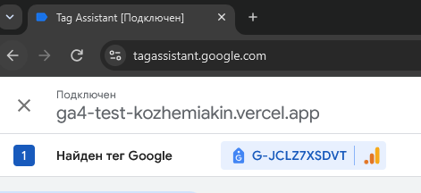
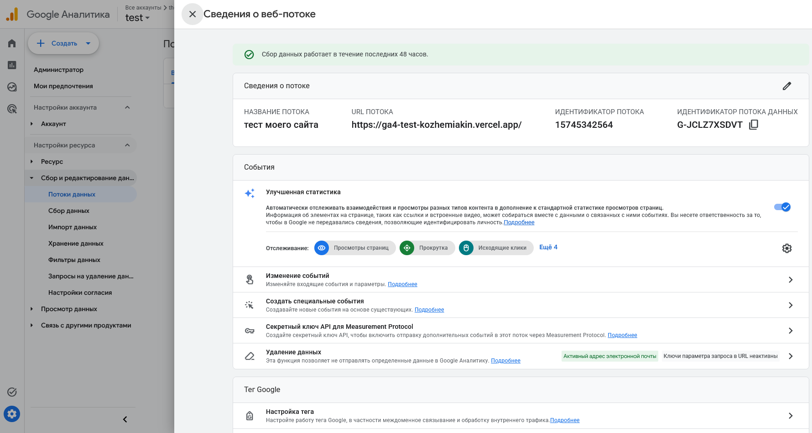
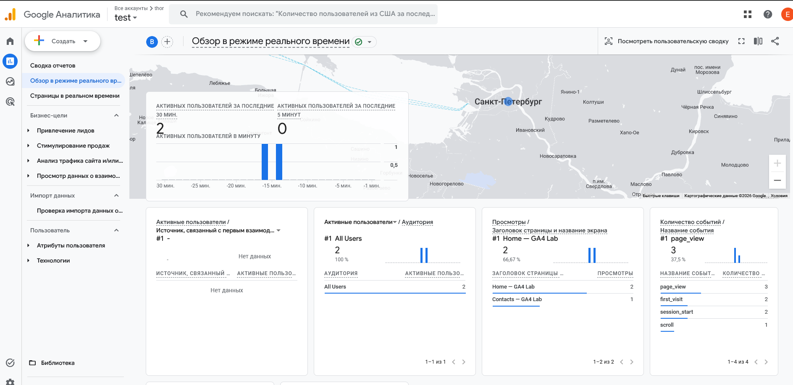
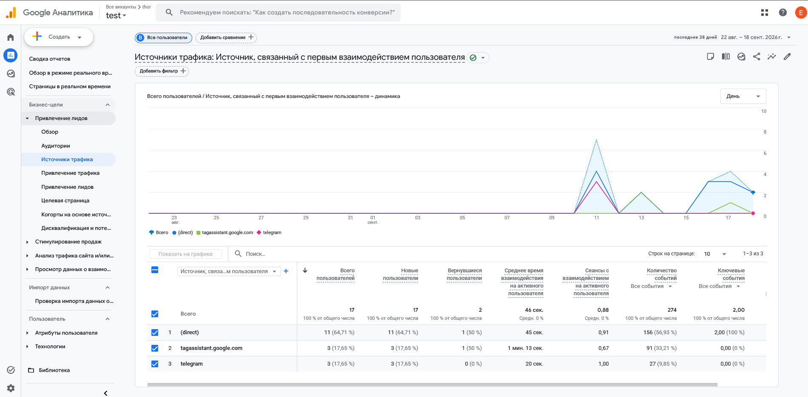
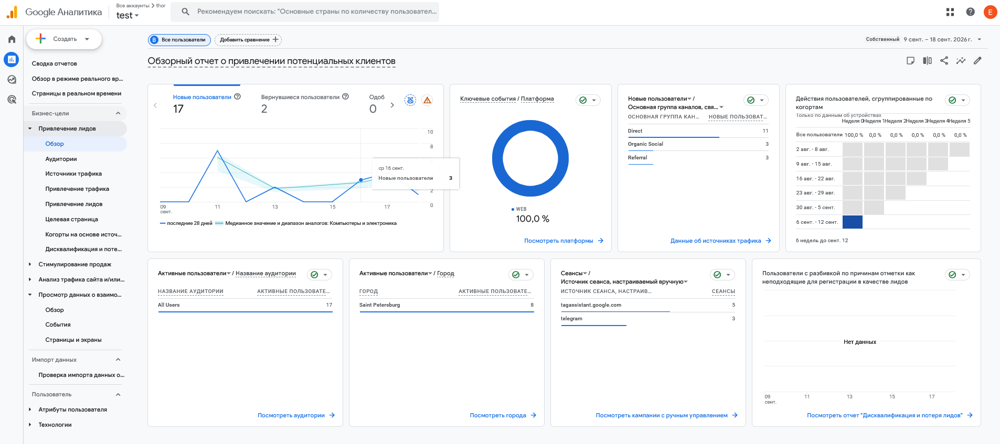
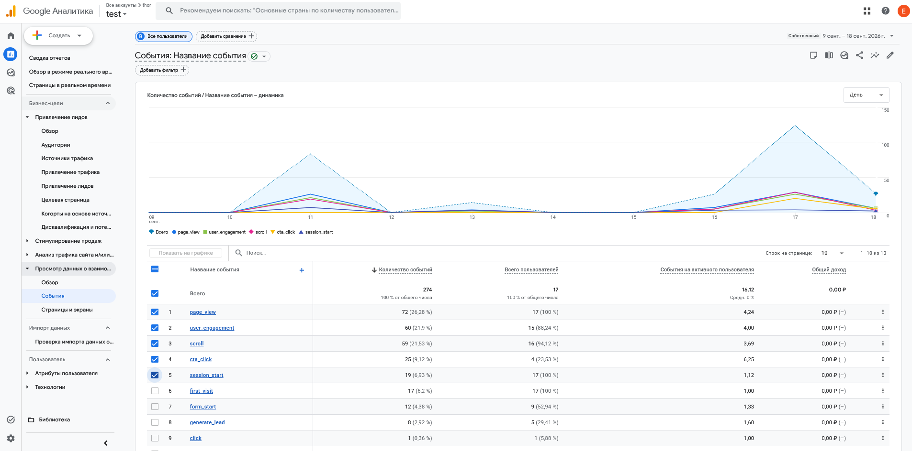

# Домашняя работа № 3 · Тег на сайте, источник и отчёты GA4

**Дисциплина:** ОП.03 «Информационные технологии»

| Поле | Значение |
|---|---|
| Фамилия, имя, отчество | Кожемякин Эрик Романович |
| Группа | РПО/1 |
| Номер работы | 3 |
| Тема работы | Установка Google Tag, источник перехода и отчёты GA4 |
| Дата сдачи |  |
| Ветка | `hw-03` |

---

## 1. Мой сайт и мой ресурс

| Поле | Значение |
|---|---|
| Адрес репозитория сайта | https://github.com/SpideErik/ga4_test_kozhemiakin |
| Публичный адрес сайта | https://ga4-test-kozhemiakin.vercel.app/ |
| Статус публикации | READY |
| Analytics Account | 407377060 |
| Property | test |
| Stream name | тест моего сайта |
| Website URL в потоке | https://ga4-test-kozhemiakin.vercel.app/ |
| Measurement ID (`G-…`) | G-JCLZ7XSDVT |
| Страницы с тегом | index.html, contacts.html, about.html |

Тег ставится на каждую страницу по одному разу: две копии дают двойные
события.

## 2. Тег установлен

**Результат проверки из инструкции тега:**

>





## 3. События доходят до аналитики

| Поле | Значение |
|---|---|
| Дата и время проверки | 13.09.2026 18:20 |
| Какие страницы открывали | index.html, contacts.html |
| Какие события появились в Realtime | page_view, first_visit, session_start, scrool |
| Число активных пользователей в момент проверки | 2 |



## 4. Источник перехода определился

Ссылка собирается с метками `utm_source`, `utm_medium`, `utm_campaign`
и открывается на своём сайте.

**Ссылка целиком:** 

```
https://ga4-test-kozhemiakin.vercel.app?utm_source=telegram&utm_medium=social&utm_campaign=ga4_lab
```

| Поле | Значение |
|---|---|
| Где в GA4 виден источник | Отчеты->Источники трафика |
| Какое значение источника показал GA4 | telegram |
| Совпадает с `utm_source` из ссылки | да |



## 5. Статистика на странице «Отчёты»

| Показатель | Значение | Период |
|---|---|---|
| Пользователи | 17 | 9-18 сентября |
| Сеансы | 8 | 9-18 сентября |
| События | 274 | 9-18 сентября |
| Самое частое событие | page-view | 9-18 сентября |




По этим данным видно распределение пользователей по месту откуда они попали на сайт и распределение событий.


## 6. Что не получилось

Не получилось найти как заполнить таблицу 5 с одной странички.

## 7. Использование ИИ

ИИ использовал только по вопросам где в ga4 что то найти.
