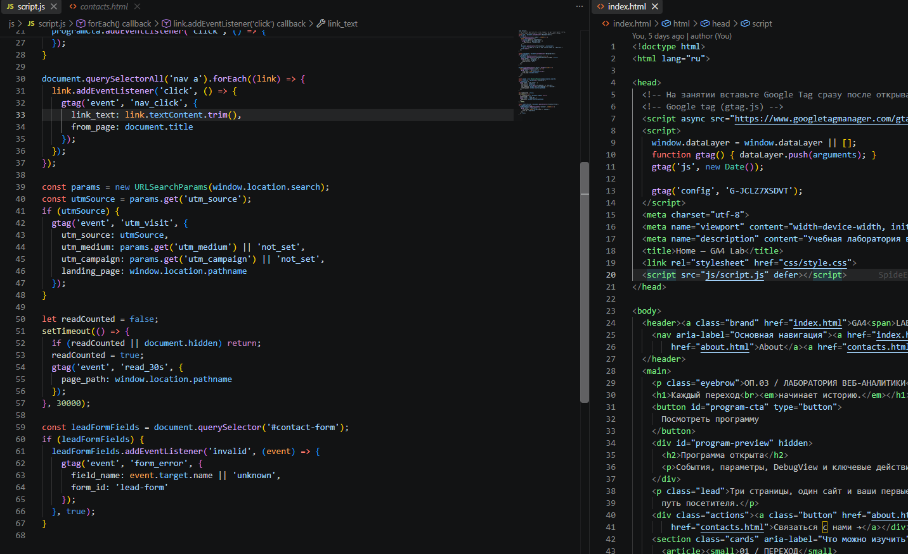
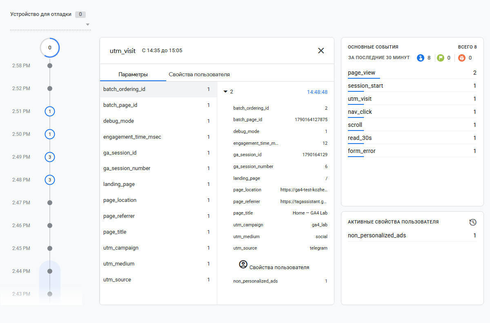
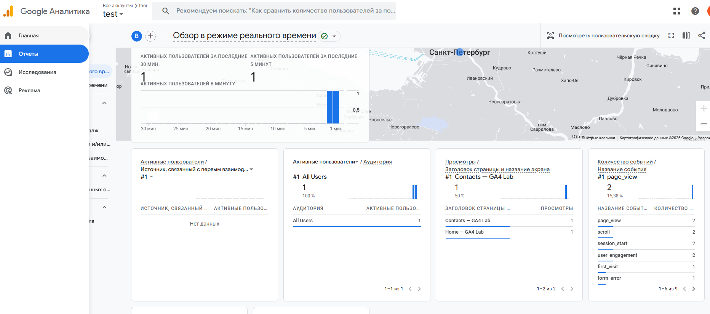
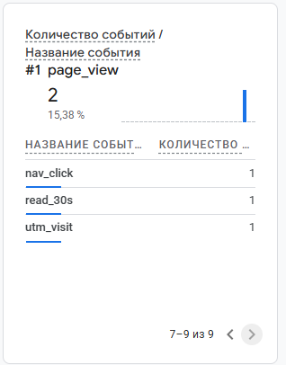

# Домашняя работа № 4 · Свои события и параметры в GA4

**Дисциплина:** ОП.03 «Информационные технологии»

| Поле | Значение |
|---|---|
| Фамилия, имя, отчество | Кожемякин Эрик Романович |
| Группа | РПО/1 |
| Номер работы | 4 |
| Тема работы | Свои события и параметры: четыре метрики на сайте |
| Дата сдачи | 23.09.2026 |
| Ветка | `hw-04` |

---

## 1. Мой сайт и мой ресурс

Новые события я добавлял не одним комитом, а по одному. В таблице указан последний.

| Поле | Значение |
|---|---|
| Публичный адрес сайта | https://ga4-test-kozhemiakin.vercel.app/ |
| Measurement ID (`G-…`) | G-JCLZ7XSDVT |
| Коммит с метриками (ссылка или первые 7 символов) | [75407a0](https://github.com/SpideErik/ga4_test_kozhemiakin/commit/75407a08e9924a8cfef5a06206012fb610eb936a) |
| Статус публикации | READY |
| Страницы, где подключён `js/metrics.js` |  |

## 2. Какие метрики добавлены

| Событие | Что измеряет | Что делали, чтобы оно сработало |
|---|---|---|
| `nav_click` | клики по пунктам меню |  |
| `utm_visit` | метки кампании из адреса |  |
| `read_30s` | полминуты на странице |  |
| `form_error` | форма не прошла проверку браузера |  |

Скриншот: 



## 3. События в DebugView

| Поле | Значение |
|---|---|
| Дата и время проверки | 23.09.2026 15:00 |
| Как подключали отладку | Tag Assistant / `debug_mode` |
| Какие из четырёх событий пришли | nav_click, utm_visit, read_30s, form_error |
| Какие не пришли и почему | пришли все 4 |

Скриншот: вставьте строку ``

## 4. Параметры события `utm_visit`

**Ссылка, по которой открывали сайт:**

```
https://ga4-test-kozhemiakin.vercel.app/?utm_source=telegram&utm_medium=social&utm_campaign=ga4_lab
```

| Параметр | Значение в ссылке | Значение в GA4 |
|---|---|---|
| `utm_source` | telegram | telegram |
| `utm_medium` | social | social |
| `utm_campaign` | ga4_lab | ga4_lab |
| `landing_page` | — | / |

Скриншот: 



Если значение в GA4 отличается от значения в ссылке, напишите, в чём разница
и почему так вышло.

> У меня все значения совпали, для landing_page указан корень сайта, что соответствует index.html

## 5. Событие вне отладки

Новые события проверял в RealTime

| Поле | Значение |
|---|---|
| Где проверяли | Realtime |
| Какое событие искали | все новые |
| Сколько срабатываний показал экран | по 1 |

Скриншот: 



Всего видов событий было больше 6, еще один скриношот второй страницы



## 6. Что эти метрики показывают про сайт

Мне кажется что nav_click в данном случае дублирует page_view, потому что у нас каждый пункт меню это новая страница.
utm_visit - может быть полезным для статистики откуда на сайт приходят пользователи (наверное его стоит сделать ключевым)
read_30s - позволит узнать сколько пользователей реально чем то заинтересовались на сайте.
form_error показывает как сделать форму проще для заполнения или сделать подробную инструкцию.


>

## 7. Что не получилось

Все получилось

## 8. Использование ИИ

Все делал сам ИИ использовал только для некоторых вопросов где что найти в ga4