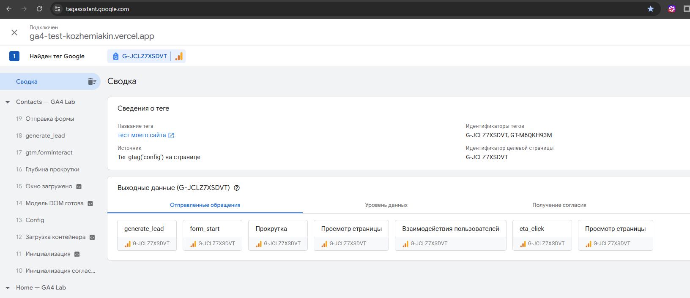
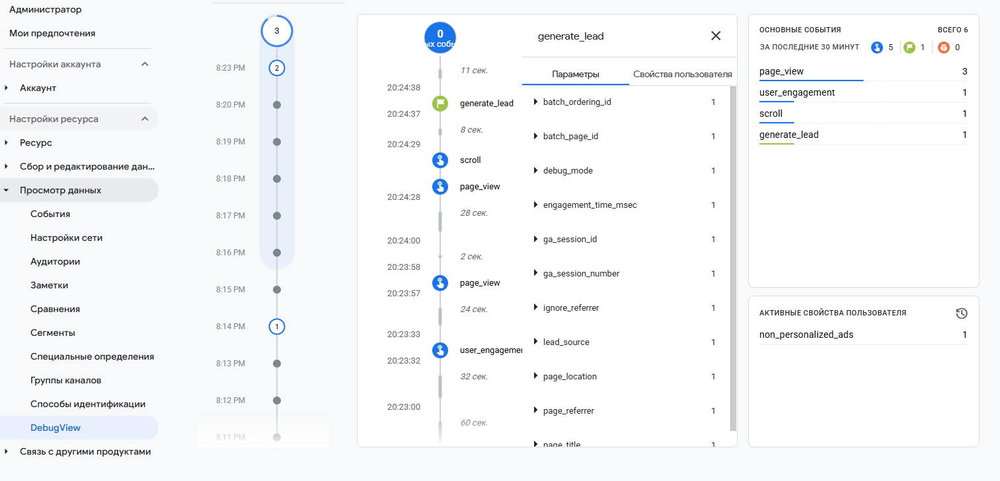
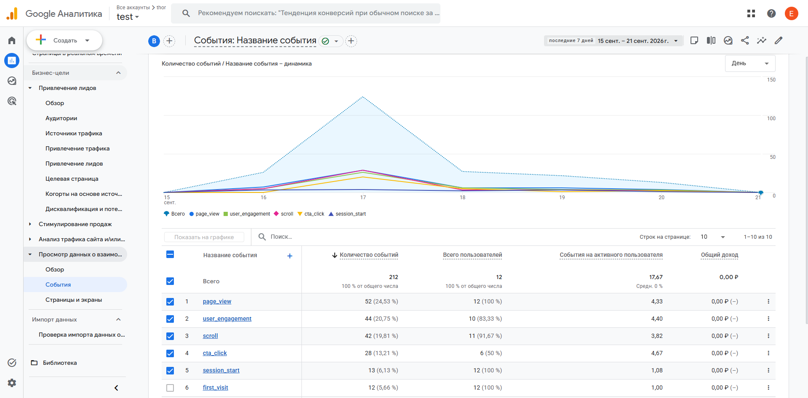
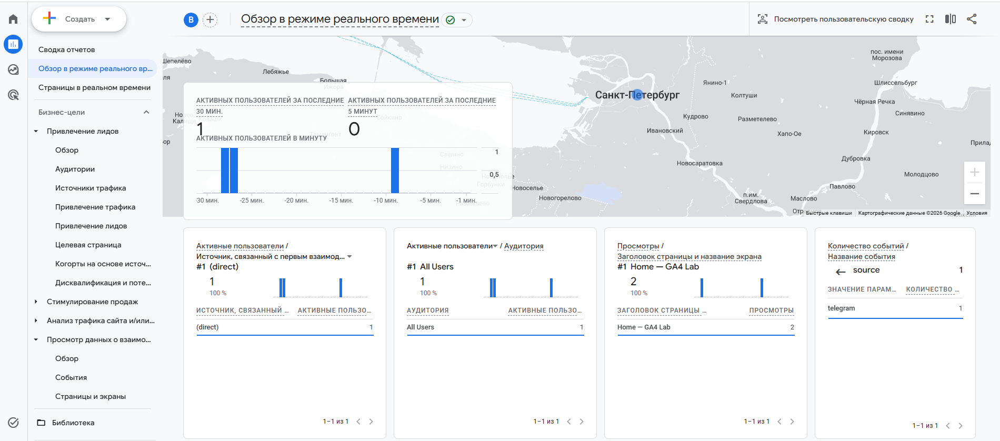

# Домашнее задание Google Analytics 4: Events и DebugView

## 1.  tagassistant

Для подключения debug_view нужно запустить google tagassistant

В tagassistant сразу отображаются события

## 2. DebugView

DebugView позволяет удобно смотреть события на временной диаграмме и смотреть все их параметры

## 3. Где еще смотреть события

В отчетах они появляются через день полтора

А сразу их можно смотреть в разделе "Обзор в режиме реального времени"

У меня все события и параметры проходят

В правом нижнем видно параметр page_view source=telegram
