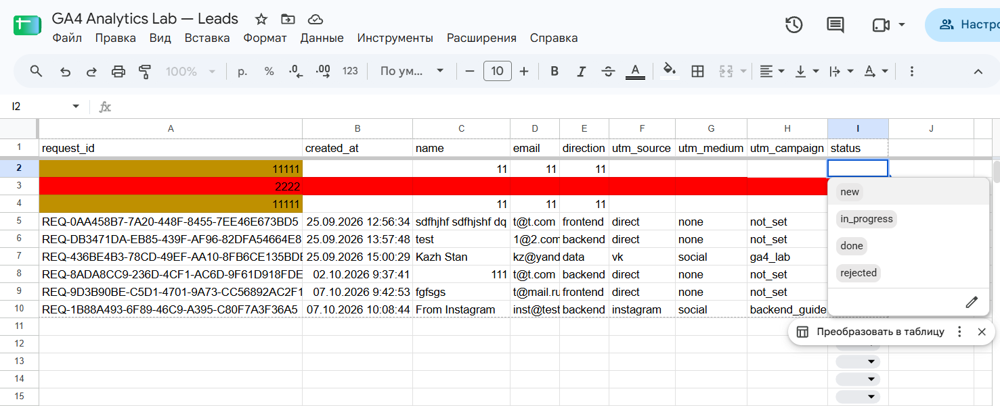
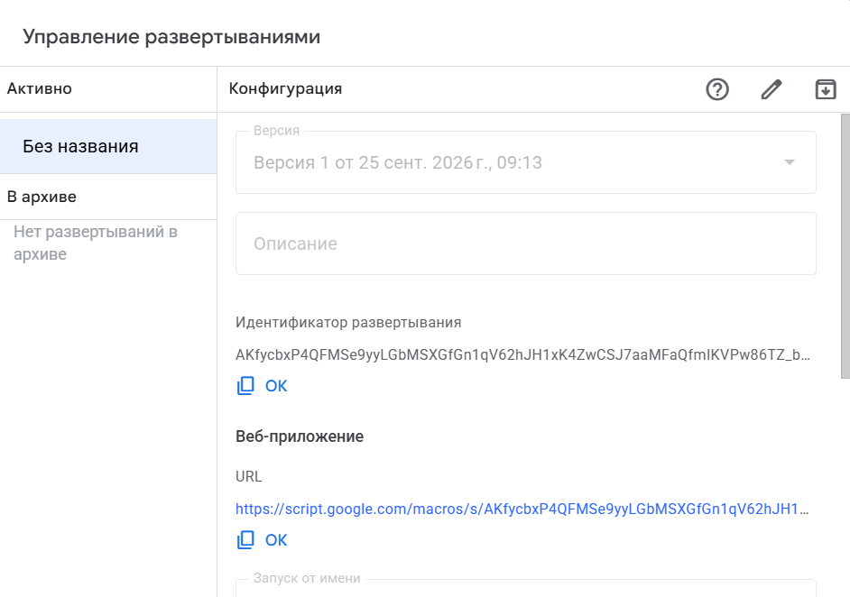
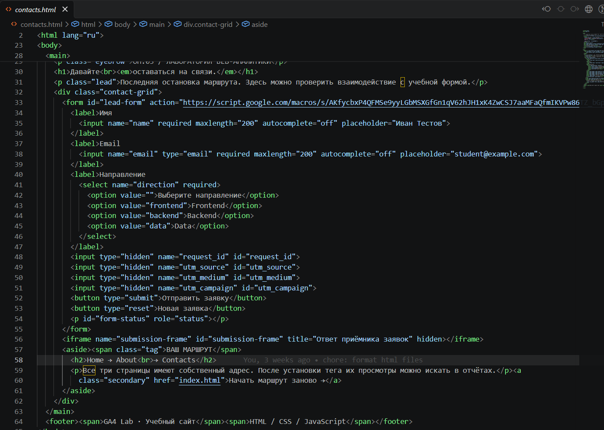
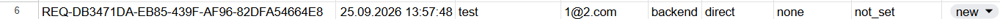
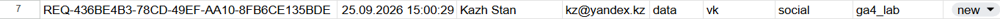
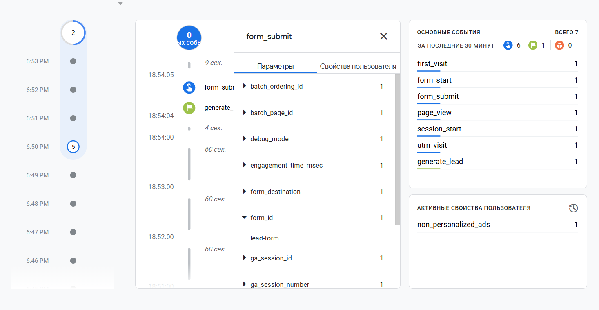
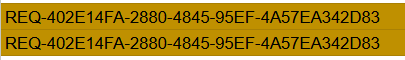
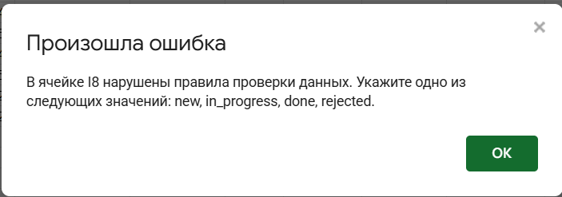

# Домашняя работа № 5 · Контролируемая таблица заявок

**Дисциплина:** ОП.03 «Информационные технологии»

| Поле | Значение |
|---|---|
| Фамилия, имя, отчество | Кожемякин Эрик Романович |
| Группа | 9/2-РПО-25/1 |
| Номер работы | 5 |
| Тема работы | Форма сайта → Apps Script → Google Таблица заявок |
| Дата сдачи | 07.10.2026 |
| Ветка | `hw-05` |

---

## 1. Мой сайт, таблица и приёмник

| Поле | Значение |
|---|---|
| Публичный адрес сайта | https://ga4-test-kozhemiakin.vercel.app/ |
| Measurement ID (`G-…`) | G-JCLZ7XSDVT |
| Ссылка на таблицу (доступ только преподавателю) | https://docs.google.com/spreadsheets/d/1EyL8Dnrr5CQD11lLx-AEhL_IMKoasWd5fkNiNm_LWm4/edit?gid=0#gid=0 |
| Название проекта Apps Script | GA4 Analytics Lab — Leads Receiver |
| Адрес Web app оканчивается на `/exec` | да |
| Коммит с новой формой (ссылка или первые 7 символов) |  |
| Статус публикации | READY |

Сам адрес Web app в бланк не вписывайте: он лежит в коде формы, этого
достаточно.

## 2. Таблица

| Что настроено | Как у меня |
|---|---|
| Заголовки A1:I1 (перечислите через запятую) | request_id, created_at, name, email, direction, utm_source, utm_medium, utm_campaign, status |
| Закреплена первая строка | да |
| Формат столбца `created_at` | Дата и время |
| Значения в списке статусов | new, in_progress, done, rejected |
| Правило 1: что подсвечивает и на каком диапазоне | Подсвечивает красным если name, email, direction не заполнены =И($A2<>"";СЧИТАТЬПУСТОТЫ($C2:$E2)>0) A2:I1000 |
| Правило 2: что подсвечивает и на каком диапазоне | Подсвечивает коричневым одинаковые request_id =И($A2<>"";СЧЁТЕСЛИ(A:A;$A2)>1) A2:A1000 |

Скриншот: 



## 3. Приёмник и форма

Скриншот: 

[Code.gs с ID своей таблицы](screens/02-apps-script.png)

Скриншот: 




Скриншот: 

`

**Что делает приёмник, когда приходит заявка** (3–4 предложения своими
словами: что он проверяет, что заполняет сам и когда отказывается писать
строку):

>

## 4. Две тестовые заявки

**Ссылка, по которой отправлена вторая заявка:**

```
https://ga4-test-kozhemiakin.vercel.app/contacts.html?utm_source=vk&utm_medium=social&utm_campaign=ga4_lab
```

| Поле | Заявка без меток | Заявка с метками |
|---|---|---|
| `request_id` из сообщения формы | REQ-DB3471DA-EB85-439F-AF96-82DFA54664E8 | REQ-436BE4B3-78CD-49EF-AA10-8FB6CE135BDE |
| `created_at` в таблице | 25.09.2026 13:57:48 | 25.09.2026 15:00:29 |
| `direction` | backend | data |
| `utm_source` | direct | vk |
| `utm_medium` | none | social |
| `utm_campaign` | not_set | ga4_lab |
| `status` | new | new |

Скриншот: 



Скриншот: 




## 5. Событие в аналитике

| Поле | Значение |
|---|---|
| Где проверяли | DebugView |
| Время отправки заявки |  |
| Пришло ли `generate_lead` | да |

Скриншот: 

**Чем событие `generate_lead` отличается от строки в таблице** (2–3 предложения):

> generate_lead событие которое генерируется, когда пользователь нажал кнопку отправить форму (GET запрос на сервер аналитики). А запись в таблице это результат обработки POST запроса к бекенду (у нас это AppScript) который и добавляет данные в таблицу.

## 6. Проверки

| Проверка | Что сделал | Что получилось |
|---|---|---|
| Пустое имя в форме |  |  |
| Повторная отправка без «Новая заявка» | Нажимал кнопку "Отправить заявку" несколько раз | Отправляется только один раз |
| Копия строки с тем же `request_id` в таблице | Скопировал строку | Поле request_id подсветилось коричневым в обоих строках |
| Статус `finished` вручную | Напечатал finished | Получил ошибку, исходное значение не поменялось |
| Смена статуса `new` → `in_progress` → `done` | Выбирал значения из списка | Статус успешно меняется |

Копию строки после кадра удалите: в таблице должны остаться только
настоящие тестовые заявки.

Скриншот: 



Скриншот: 



## 7. Что не получилось

Если какой-то шаг не заработал, напишите какой, что показывал экран
или журнал **Executions** и что было проверено по таблице из `README.md`.
Незаполненный раздел означает, что всё получилось.

> Во время создания этого отчета, у меня случайно поменялись строки в таблице, у меня перестали добавляться данные в таблицу. В браузере devtools ответ на post у меня не виден, поэтому при помощи ии я написал скрипт, который отправляет post запрос с ПК и печатает ответ. Получив ответ {"ok":false,"error":"invalid_sheet_schema"} я понял что изменились названия колонок.

## 8. Использование ИИ

Код приёмника и формы выдан готовым. Таблицу, публикацию, проверки и кадры
вы делаете сами. ИИ допускается для формулировок и оформления.

| Вопрос | Ответ |
|---|---|
| Что сделано самостоятельно | все по заданию |
| Что спрошено у модели | выяснял почему сломался скрипт и как с ПК проверить ответ |
| Что после этого изменено | несколько раз делал deployment Apps Script из-за этого пришлось менять ссылку для post метода в form |
