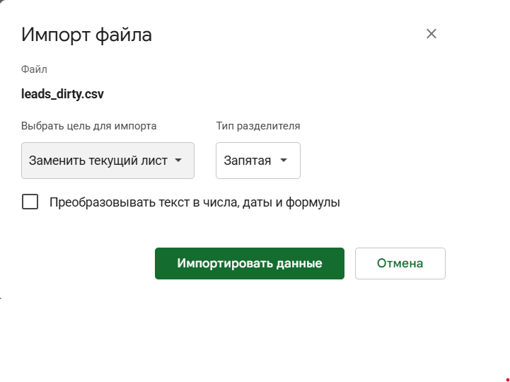
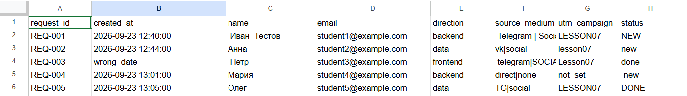
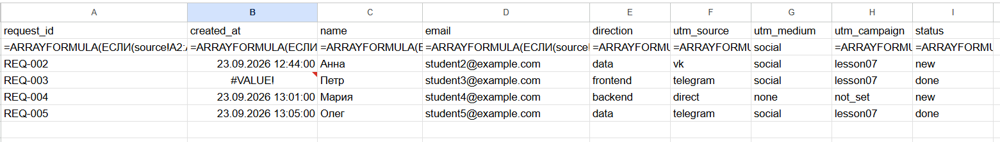
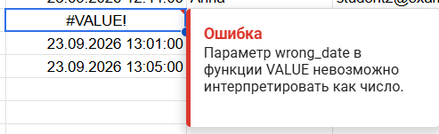
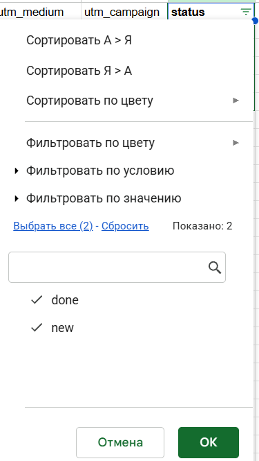
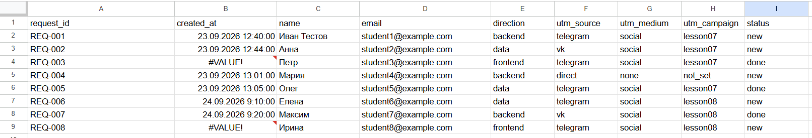

# Домашняя работа № 6 · Подготовка данных в Google Таблицах

**Дисциплина:** ОП.03 «Информационные технологии»

| Поле | Значение |
|---|---|
| Фамилия, имя, отчество | Кожемякин Эрик Романович |
| Группа | 9/2-РПО-25/1 |
| Номер работы | 6 |
| Тема работы | Повторяемая очистка выгрузки заявок в Google Таблицах |
| Дата сдачи | 07.10.2026 |
| Ветка | hw-06 |

---

## 1. Моя таблица

| Поле | Значение |
|---|---|
| Название таблицы | leads_cleaning |
| Ссылка на таблицу (доступ только преподавателю) | https://docs.google.com/spreadsheets/d/1BCbbwINGlfGRnVfJPTfwhxelUecAKJNK2jcW_1zKAEg |
| Листы таблицы (по порядку) | source, leads_clean, check |
| Регион в настройках таблицы | Россия |

## 2. Импорт

| Настройка окна «Импорт файла» | Что выбрано |
|---|---|
| Файл | leads_dirty.csv |
| Цель импорта | Получить исходные данные для обработки |
| Разделитель | Запятая |
| «Преобразовывать текст в числа, даты и формулы» | выключено |

Скриншот: 

Скриншот:

**Почему флажок преобразования снят** (1–2 предложения):

> Чтобы не было разных форматов в разных ячейках одной колонки

## 3. Правила

Впишите формулу каждого столбца так, как она стоит у вас во второй строке
листа `leads_clean`.

| Столбец | Заголовок | Формула |
|---|---|---|
| A | `request_id` | `=ARRAYFORMULA(ЕСЛИ(source!A2:A="";;СЖПРОБЕЛЫ(source!A2:A)))` |
| B | `created_at` | `=ARRAYFORMULA(ЕСЛИ(source!B2:B="";;ЗНАЧЕН(СЖПРОБЕЛЫ(source!B2:B))))` |
| C | `name` | `=ARRAYFORMULA(ЕСЛИ(source!C2:C="";;СЖПРОБЕЛЫ(ПЕЧСИМВ(source!C2:C))))` |
| D | `email` | `=ARRAYFORMULA(ЕСЛИ(source!D2:D="";;СЖПРОБЕЛЫ(ПЕЧСИМВ(source!D2:D))))` |
| E | `direction` | `=ARRAYFORMULA(ЕСЛИ(source!E2:E="";;СЖПРОБЕЛЫ(ПЕЧСИМВ(source!E2:E))))` |
| F | `utm_source` | `=ARRAYFORMULA(ЕСЛИ(source!F2:F="";;LET(v;СТРОЧН(СЖПРОБЕЛЫ(SPLIT(source!F2:F;"|")));ЕСЛИ(v="tg";"telegram";v))))` |
| G | `utm_medium` | заполняется формулой из F2 |
| H | `utm_campaign` | `=ARRAYFORMULA(ЕСЛИ(source!G2:G="";;СТРОЧН(СЖПРОБЕЛЫ(ПЕЧСИМВ(source!G2:G)))))` |
| I | `status` | `=ARRAYFORMULA(ЕСЛИ(source!H2:H="";;СТРОЧН(СЖПРОБЕЛЫ(ПЕЧСИМВ(source!H2:H)))))` |

Скриншот: 

## 4. Ошибка и проверка значений

| Поле | Значение |
|---|---|
| В какой строке `#VALUE!` после v1 (`request_id`) | 4 |
| Что написано в подсказке ошибки | Ошибка
Параметр wrong_date в функции VALUE невозможно интерпретировать как число. |
| Какое значение в исходнике её вызвало | wrong_date |
| Значения в фильтре `status` |  done, new |

Скриншот: 

Скриншот:  

**Почему ошибку не прячут функцией ЕСЛИОШИБКА** (1–2 предложения):

> Если спрятать не будет видно какие ошибки часто встречаются. И не понятно на что менять ошибочное значение и как увидеть что были ошибки.

## 5. Вторая выгрузка

| Показатель | После v1 | После v2 |
|---|---|---|
| Строк в `leads_clean` | 6 | 9 |
| Строк с `#VALUE!` | 1 | 2 |
| Сколько формул пришлось менять | — | 0 |

Строка `REQ-006` после очистки:

| `name` | `utm_source` | `utm_medium` | `utm_campaign` | `status` |
|---|---|---|---|---|
| Елена | telegram | social | lesson08 | new |

Скриншот: 

`

Результат скачан и лежит в папке: `leads_clean.csv` — да 

[leads_clean.csv](assets/leads_clean.csv)

## 6. Проверка структуры

| Поле | Значение |
|---|---|
| Формула в A1 листа `check` | `=ЕСЛИ(JOIN(",";source!A1:H1)="request_id,created_at,name,email,direction,source_medium,utm_campaign,status";"структура source: OK";"СТОП: изменились столбцы source")` |
| Что она показывает сейчас | структура source: OK |
| Что покажет, если в CSV переставить столбцы | СТОП: изменились столбцы source |

Скриншот: вставьте строку ``

## 7. Что эти правила не исправят

Два-три предложения: какие ошибки в данных остаются даже после очистки.
Например, данные приведены к одному виду, но могут быть неверными
по смыслу.

> Например нет проверки правильности email, корректности request_id. Вместо имени может быть белиберда.

## 8. Что не получилось

Если какой-то шаг не заработал, напишите какой, что показывала таблица
и что было проверено по таблице из `README.md`. Незаполненный раздел
означает, что всё получилось.

>

## 9. Использование ИИ

Формулы разобраны в лекции. Импорт, правила, проверки и кадры вы делаете
сами. ИИ допускается для формулировок и оформления.

| Вопрос | Ответ |
|---|---|
| Что сделано самостоятельно | все делал на паре, кроме скриншотов которые делал дома когда появился шаблон |
| Что спрошено у модели |  |
| Что после этого изменено |  |
