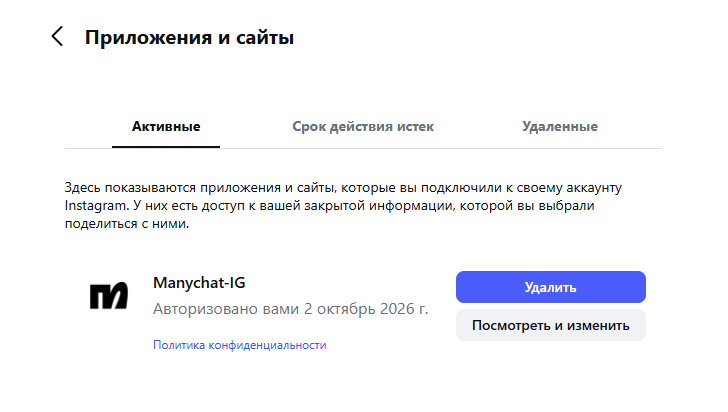
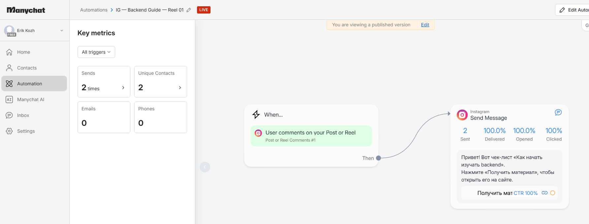
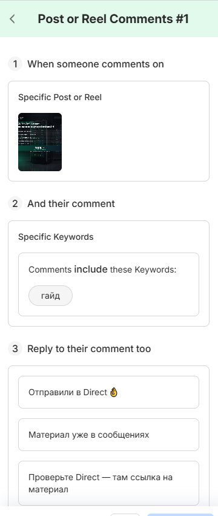
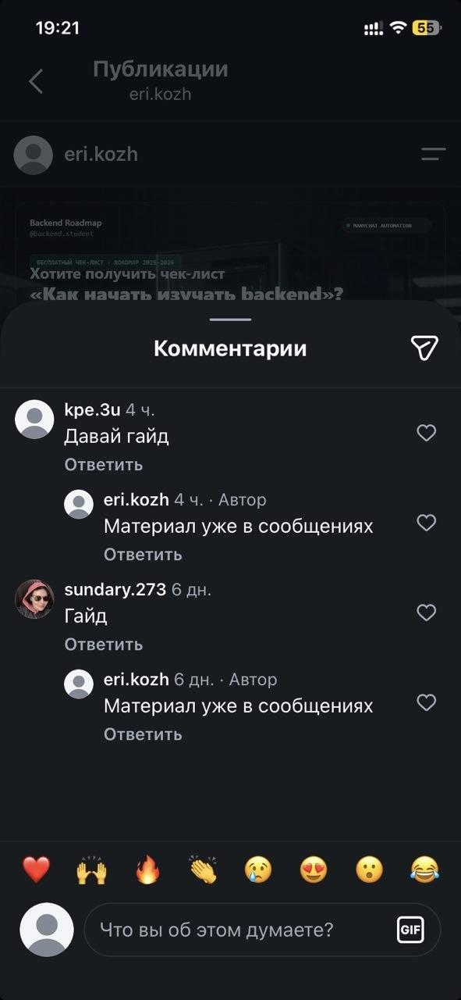
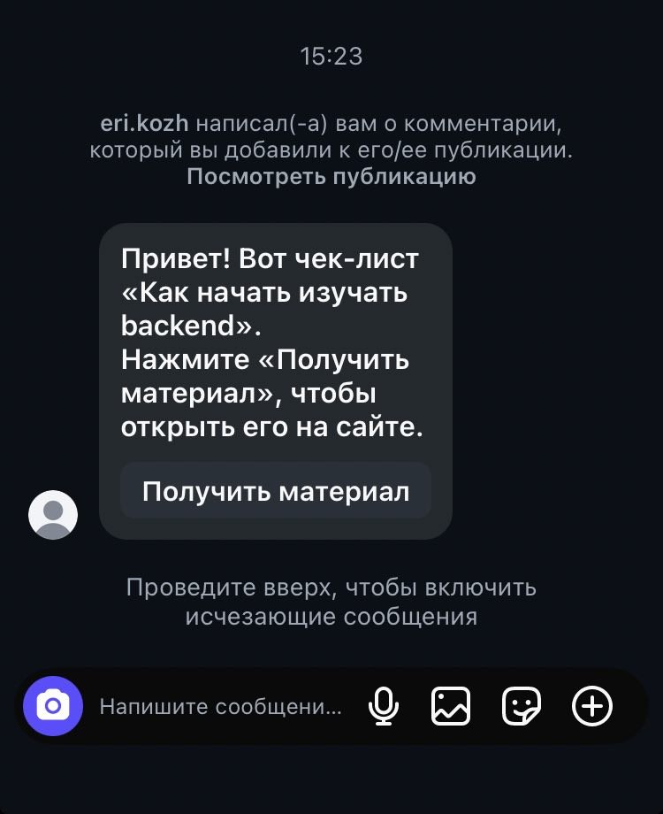
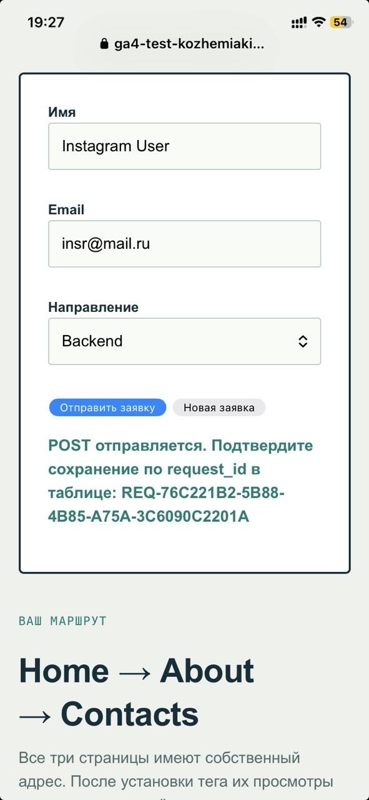
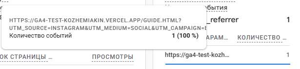
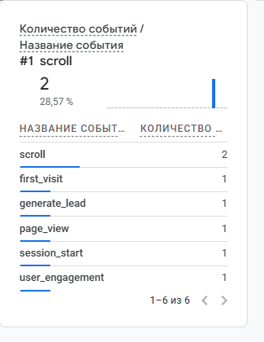
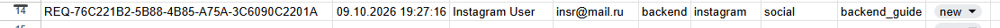

# Домашняя работа № 7 · Instagram → ManyChat → заявка

**Дисциплина:** ОП.03 «Информационные технологии»

| Поле | Значение |
|---|---|
| Фамилия, имя, отчество | Кожемякин Эрик Романович |
| Группа | 9/2-РПО-25/1 |
| Номер работы | 7 |
| Тема работы | Автоворонка из Instagram: комментарий → сообщение → сайт → заявка |
| Дата сдачи | 09.10.2026 |
| Ветка | `hw-07` |

Текст ниже уже написан. Замените `___` своими данными и вставьте кадры
вместо строк «Скриншот: …».

---

## 1. Подключение и automation

Я перевёл учебный аккаунт Instagram в профессиональный и подключил его
к ManyChat на тарифе Free. Собрал automation: триггер на комментарий под
выбранной публикацией, ключевое слово `ГАЙД`, публичный ответ, личное
сообщение и кнопка «Получить материал» со ссылкой с UTM. Automation
включена в режиме Live.

| Мои данные | Значение |
|---|---|
| Учебный аккаунт Instagram | eri.kozh |
| Ссылка на учебную публикацию | https://www.instagram.com/p/Dd-yyksiMJh/ |
| Публичный адрес сайта | https://ga4-test-kozhemiakin.vercel.app/ |
| Measurement ID (`G-…`) | G-JCLZ7XSDVT |

Скриншот: 

Скриншот: 

Скриншот: 

## 2. Тест цепочки

Со второго аккаунта ___ я оставил комментарий `ГАЙД`. Под ним появился
автоматический ответ, а в Direct пришло сообщение с кнопкой. Кнопка
открыла `guide.html` с метками в адресе, оттуда я перешёл к форме
и отправил тестовую заявку.

> Т.к. делал скриншоты с телефона, в приложении не показывают адресную строку, я сделал скриншоты после отправления формы и page_refer в событии generate_lead

Скриншот: 

Скриншот:

Скриншот: 

Скриншот: 

## 3. Результат

В GA4 пришли `page_view` со страницы `guide.html` и `generate_lead`.
В листе `leads` появилась строка с метками `instagram` / `social` /
`backend_guide` и статусом `new`.

`request_id` заявки: REQ-76C221B2-5B88-4B85-A75A-3C6090C2201A

Скриншот: 

Скриншот: 

---

Не получилось (если всё работает, оставьте пустым): 

ИИ: не использовал
